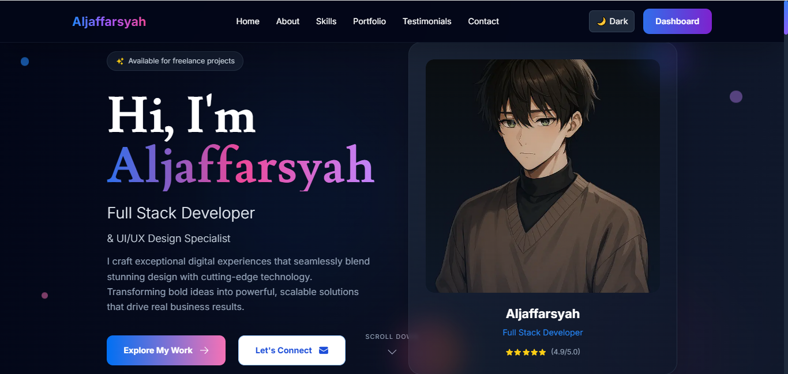

# Web Aljaffarsyah

[](./public/homepage.png)

Ini adalah proyek personal website portfolio yang dibangun menggunakan Next.js, React, dan TailwindCSS.

## Fitur Utama

- Landing page modern dan responsif
- Dark mode & light mode
- Navigasi dinamis
- Section: Hero, About, Skills, Portfolio, Testimonials, Contact, Footer
- Animasi dan efek visual
- Optimasi performa dan SEO

## Struktur Folder

- `app/` : Semua komponen dan halaman utama
- `public/` : Asset gambar dan ikon
- `styles/` : Konfigurasi Tailwind dan CSS global

## Cara Menjalankan

1. Install dependencies:
   ```bash
   pnpm install
   ```
2. Jalankan development server:
   ```bash
   pnpm dev
   ```
3. Buka di browser: [http://localhost:3000](http://localhost:3000)

## Kontribusi

Pull request dan issue sangat diterima untuk pengembangan lebih lanjut.

## Lisensi

MIT
